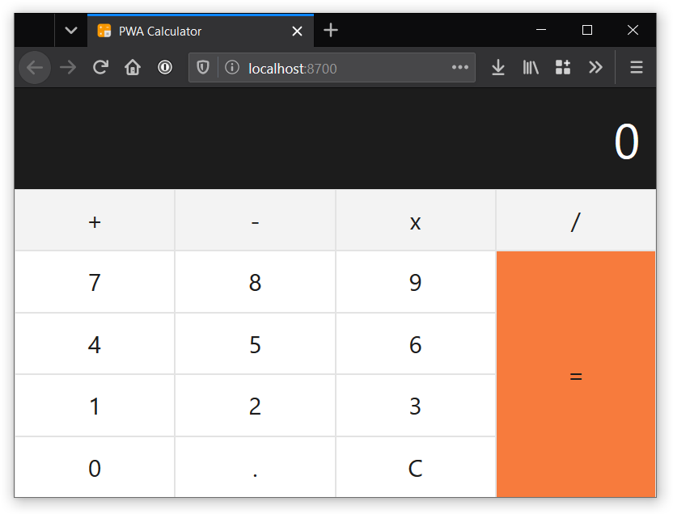

<!-- markdownlint-disable MD033 -->

<div align="center">

# calculator-pwa-clojurescript

Calculator PWA using ClojureScript + shadow-cljs + Reagent

[](https://calculator-pwa-clojurescript.now.sh)

<https://calculator-pwa-clojurescript.now.sh> <br />
<https://calc-cljs.now.sh>

</div>

## Run and develop locally

```sh
# clone repository and access directory
git clone https://github.com/surabayajs/calculator-pwa-clojurescript.git
cd calculator-pwa-clojurescript

# install dependencies
yarn

# run on develop mode
yarn develop
# or
yarn watch

# build production assets
yarn build
# or
yarn release
```

## Packages used

### ClojureScript

- [`reagent`](https://reagent-project.github.io)
- [`binaryage/cljs-devtools`](https://github.com/binaryage/cljs-devtools)
- [`funcool/cuerdas`](https://github.com/funcool/cuerdas)

### Javascript

- [`create-react-class`](https://www.npmjs.com/package/create-react-class)
- [`react`](https://www.npmjs.com/package/react)
- [`react-dom`](https://www.npmjs.com/package/react-dom)
- [`shadow-cljs`](https://www.npmjs.com/package/shadow-cljs)
- [`xregexp`](https://www.npmjs.com/package/xregexp)

## Contributors

<!-- ALL-CONTRIBUTORS-LIST:START - Do not remove or modify this section -->
<!-- prettier-ignore-start -->
<!-- markdownlint-disable -->
<table>
  <tr>
    <td align="center"><a href="https://ampersanda.dev"><br /><sub><b>Ampersanda</b></sub></a><br /><a href="https://github.com/surabayajs/calculator-pwa-clojurescript/commits?author=ampersanda" title="Code">💻</a> <a href="#design-ampersanda" title="Design">🎨</a></td>
    <td align="center"><a href="https://griko.id"><br /><sub><b>Griko Nibras</b></sub></a><br /><a href="https://github.com/surabayajs/calculator-pwa-clojurescript/commits?author=grikomsn" title="Documentation">📖</a></td>
  </tr>
</table>

<!-- markdownlint-enable -->
<!-- prettier-ignore-end -->
<!-- ALL-CONTRIBUTORS-LIST:END -->

## License

[MIT License, Copyright (c) 2020 Mochamad Lucky Pradana](./LICENSE)
